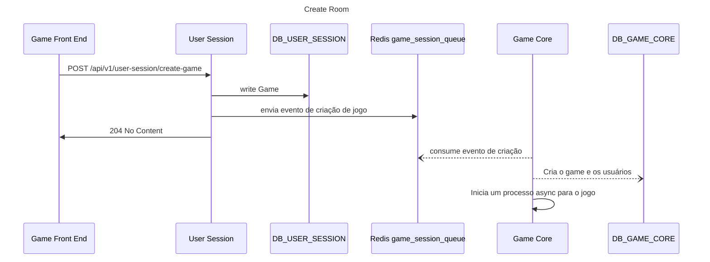

```mermaid
sequenceDiagram
    title game flow
    par send Information
        Game Front End ->> Game Core : "[wss] /api/v1/game-core/{gameId}/player-movements : send player movements"
        Game Core ->>
        Game Core ->> Redis game_action_queue_{gameId} : Send Event
    and receive information
        Game Core ->> Game Front End : "[wss] : receive map updates"
    end 

```