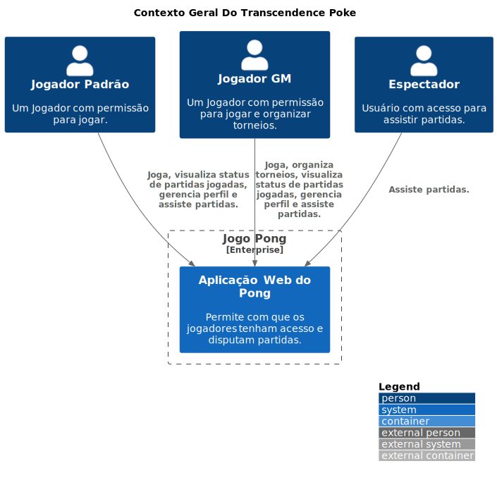

# Contexto Geral de Arquitetura

Por se tratar de um sistema distribuído em microsserviços, que em termos de escalabilidade, flexibilidade de tecnologia e facilidade ao implementar novas regras de negócio por dividi-las por funções e áreas específicas, trás muitos benefícios um contraponto disso é o aumento da complexibilidade e a visualização das integrações feitas pelos microsserviços.

Dessa forma essa sessão do projeto é dedicada em exemplificar de forma geral como o sistema como um todo se comunica e como serão feitas suas integrações  através do uso do modelo C4.

## Context
    
O nível de contexto é o primeiro e mais alto nível de abstração no C4 Model, uma abordagem utilizada para descrever a arquitetura de sistemas de software de maneira visual e estruturada. Neste nível, o objetivo principal é fornecer uma visão macro do sistema de software, destacando suas interações com os atores externos, que podem ser usuários, sistemas externos, organizações ou outros elementos externos relevantes.

A visão de contexto responde essencialmente à pergunta: "Qual é o papel do sistema dentro do ambiente mais amplo em que ele opera?". Ela ajuda a definir os limites do sistema, mostrando de maneira simplificada quem utiliza o sistema e com quais outros sistemas ele se comunica.

A ideia central do sistema é permitir que jogadores com diferentes características de acesso realizem ações diversas ao acessar o jogo, dessa forma as responsabilidades dos perfis de “jogadores” foram distribuídas em 3 níveis e todas as funcionalidades do sistema serão distribuídas dentro de seus microsserviços sem a necessidade de serviços externos.

## Diagram

<code>

</code>

