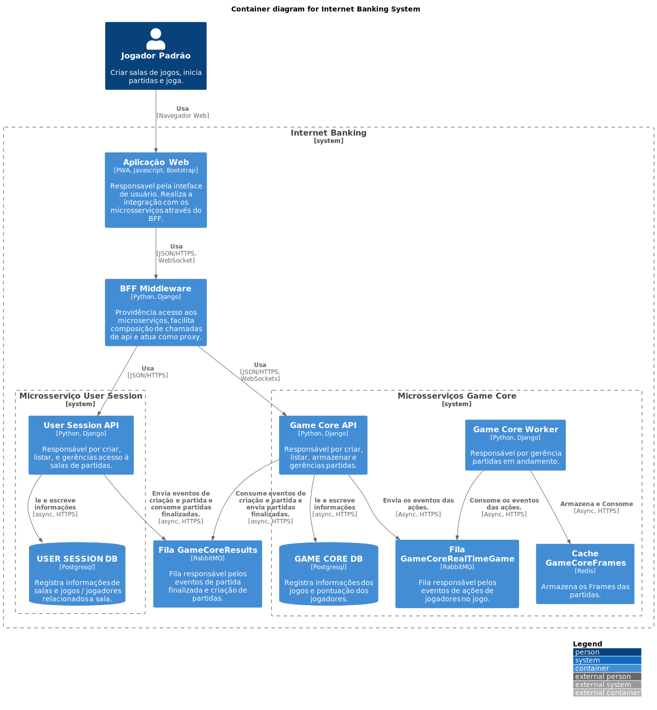

## Diagram

<code>
@startuml
!include https://raw.githubusercontent.com/plantuml-stdlib/C4-PlantUML/master/C4_Container.puml
' uncomment the following line and comment the first to use locally
' !include C4_Container.puml

' LAYOUT_TOP_DOWN()
' LAYOUT_AS_SKETCH()
LAYOUT_WITH_LEGEND()

title Container diagram for Internet Banking System

Person(player, Jogador Padrão, "Criar salas de jogos, inicia partidas e joga.")

System_Boundary(c1, "Internet Banking") {
    Container(gameFront, "Aplicação Web", "PWA, Javascript, Bootstrap", "Responsavel pela inteface de usuário. Realiza a integração com os microsserviços através do BFF.")
    Container(BFF, "BFF Middleware", "Python, Django", "Providência acesso aos microserviços, facilita composição de chamadas de api e atua como proxy.")
    
    System_Boundary(usm, "Microsserviço User Session") {
        Container(userSession, "User Session API", "Python, Django", "Responsável por criar, listar, e gerências acesso á salas de partidas.")
        ContainerDb(userSessionDB, "USER SESSION DB", "Postgresql", "Registra informações de salas e jogos / jogadores relacionados a sala.")
    }

    System_Boundary(gm, "Microsserviços Game Core") {
        Container(gameCore, "Game Core API", "Python, Django", "Responsável por criar, listar, armazenar e gerências partidas.")
        Container(gameCoreWorker, "Game Core Worker", "Python, Django", "Responsável por gerência partidas em andamento.")
        Container(gameCoreMessage, "Fila GameCoreRealTimeGame", "RabbitMQ", "Fila responsável pelos eventos de ações de jogadores no jogo.")
        Container(gameCoreBuffer, "Cache GameCoreFrames", "Redis", "Armazena os Frames das partidas.")
        ContainerDb(gameCoreDB, "GAME CORE DB", "Postgresql", "Registra informações dos jogos e pontuação dos jogadores.")
    }

    Container(gameCoreToUserSession, "Fila GameCoreResults", "RabbitMQ", "Fila responsável pelos eventos de partida finalizada e criação de partidas.")
}

Rel(player, gameFront, "Usa", "Navegador Web")
Rel(gameFront, BFF, "Usa", "JSON/HTTPS, WebSocket")

Rel(BFF, userSession, "Usa", "JSON/HTTPS")
Rel(userSession, userSessionDB, "le e escreve informações", "async, HTTPS")
Rel(userSession, gameCoreToUserSession, "Envia eventos de criação e partida e consome partidas finalizadas.", "async, HTTPS")
Rel(gameCore, gameCoreToUserSession, "Consume eventos de criação e partida e envia partidas finalizadas.", "async, HTTPS") 

Rel(BFF, gameCore, "Usa", "JSON/HTTPS, WebSockets")
Rel(gameCoreWorker, gameCoreMessage, "Consome os eventos das ações.", "Async, HTTPS")
Rel(gameCoreWorker, gameCoreBuffer, "Armazena e Consome", "Async, HTTPS")
Rel(gameCore, gameCoreMessage, "Envia os eventos das ações.", "Async, HTTPS")
Rel(gameCore, gameCoreDB, "le e escreve informações", "async, HTTPS")
@enduml
</code>

